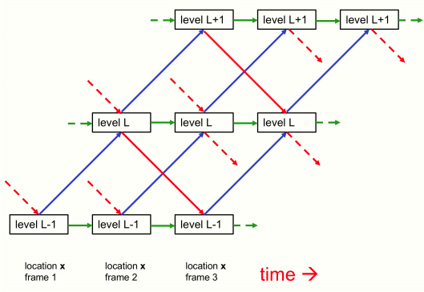
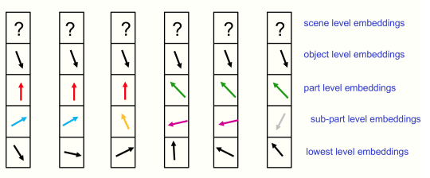

</img>

</img>

## GLOM - Pytorch

An attempt at the implementation of <a href="https://arxiv.org/abs/2102.12627">Glom</a>, Geoffrey Hinton's new idea that integrates neural fields, predictive coding, top-down-bottom-up, and attention (consensus between columns) for emergent part-whole heirarchies from data.

## Install

```bash
$ pip install glom-pytorch
```

## Usage

```python
import torch
from glom_pytorch import Glom

model = Glom(
    dim = 512,         # dimension
    levels = 6,        # number of levels
    image_size = 224,  # image size
    patch_size = 14    # patch size
)

img = torch.randn(1, 3, 224, 224)
levels = model(img, iters = 12) # (1, 256, 6, 512) - (batch - patches - levels - dimension)
```

If you were to pass the `return_all = True` keyword argument on forward, you will be returned all the column and level states per iteration, including the initial state (so number of iterations + 1). You can then use this to attach any losses to any time step you wish, to induce emergence of whatever.

This also gives you access to all the data for clustering for the theorized islands that should form.

```python
import torch
from glom_pytorch import Glom

model = Glom(
    dim = 512,         # dimension
    levels = 6,        # number of levels
    image_size = 224,  # image size
    patch_size = 14    # patch size
)

img = torch.randn(1, 3, 224, 224)
all_levels = model(img, iters = 12, return_all = True) # (13, 1, 256, 6, 512) - (batch, patches, levels, dimension)

# get the top level outputs after iteration 6
top_level_output = all_levels[7, :, :, -1] # (1, 256, 512) - (batch, patches, dimension)
```

Denoising self-supervised learning for encouraging emergence, as described by Hinton

```python
import torch
import torch.nn.functional as F
from torch import nn
from einops.layers.torch import Rearrange

from glom_pytorch import Glom

model = Glom(
    dim = 512,         # dimension
    levels = 6,        # number of levels
    image_size = 224,  # image size
    patch_size = 14    # patch size
)

img = torch.randn(1, 3, 224, 224)
noised_img = img + torch.randn_like(img)

all_levels = model(noised_img, return_all = True)

patches_to_images = nn.Sequential(
    nn.Linear(512, 14 * 14 * 3),
    Rearrange('b (h w) (p1 p2 c) -> b c (h p1) (w p2)', p1 = 14, p2 = 14, h = (224 // 14))
)

top_level = all_levels[6, :, :, -1]
recon_img = patches_to_images(top_level)

# do self-supervised learning by denoising

loss = F.mse_loss(img, recon_img)
loss.backward()
```

### Todo

- [ ] contrastive / consistency regularization of top-ish levels

## Citations

```bibtex
@misc{hinton2021represent,
    title   = {How to represent part-whole hierarchies in a neural network}, 
    author  = {Geoffrey Hinton},
    year    = {2021},
    eprint  = {2102.12627},
    archivePrefix = {arXiv},
    primaryClass = {cs.CV}
}
```
